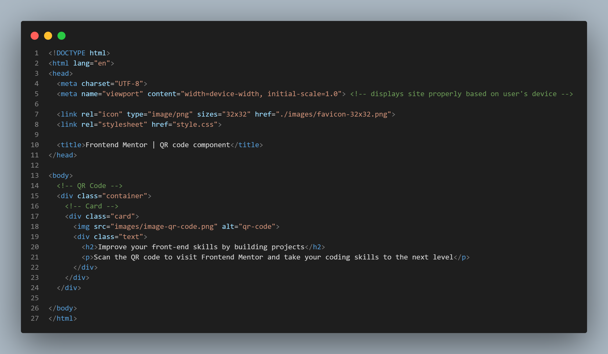

# Frontend Mentor - QR code component solution

This is a solution to the [QR code component challenge on Frontend Mentor](https://www.frontendmentor.io/challenges/qr-code-component-iux_sIO_H). Frontend Mentor challenges help you improve your coding skills by building realistic projects. 

## Table of contents

- [Overview](#overview)
  - [Screenshot](#screenshot)
  - [Links](#links)
- [My process](#my-process)
  - [Built with](#built-with)
  - [What I learned](#what-i-learned)
  - [Useful resources](#useful-resources)
- [Author](#author)
- [Acknowledgments](#acknowledgments)

## Overview

### Screenshot

### Links

- Solution URL: [Add solution URL here](https://your-solution-url.com)
- Live Site URL: [Add live site URL here](https://your-live-site-url.com)

## My process

### Built with

- HTML5
- CSS3

### What I learned

Learned display:flex, :root, and make me work faster

### Useful resources

- [W3Schools](https://www.w3schools.com) - W3Schools have helped me for figuring out how to center the image using flex and :root.

## Author

- Website - [PastGH](https://pastgh.github.io)
- Frontend Mentor - [@PastGH](https://www.frontendmentor.io/profile/PastGH)

## Acknowledgments

I would suggest to remove the attribution as it destroy everything and make your job harder. (If you include it, it won't center the qr code card)